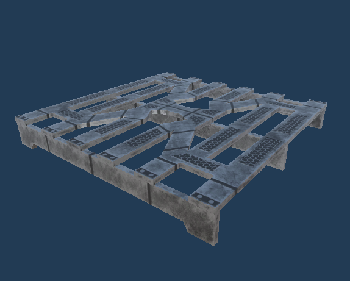

# 프로젝트명 : Undocked(1988037 이휘재)

# [컨셉]

## 메인컨셉 : 탈출

- 행성을 탐사하기 위해 만든 기지에서 의문의 사고로부터 탈출하는 컨셉을 통해 SF적인 요소를 더함으로써 유저들에게 흥미를 준다.
- 탈출이라는 목표를 설정함으로써 게임 클리어 후에 해방감을 느낄 수 있도록 한다.

### 서브 컨셉 1 : 전투

- fps 요소를 활용하여 원거리 공격으로 적과 전투를 한다.
- 공격 시 다양한 이펙트를 통해 타격감을 준다. 

### 서브 컨셉 2 : 길 찾기

- 플레이어는 맵 어딘가에 있는 목표지점을 찾아 이동해야한다.

### 서브 컨셉 3 : 생존

- 적의 공격으로부터 생존해야 한다.
- 플레이어에게 체력을 부여하고 체력을 관리하도록 해 게임이 지루하지 않게 한다. 

### 서브 컨셉 4 : 적 AI

- 적에게 ai를 부여해 플레이어에게 접근하거나 공격하도록하여 플레이어에게 긴장감을 준다.

### 서브 컨셉 5 : 지형 상호작용

- 아이템을 활용해 통행에 방해되는 지형을 부숴 길을 터 이동할 수 있다.
- 퍼즐 요소로 게임 클리어 조건으로 작용된다.

  

# [관련 이미지 & 동영상]

- 이미지  
   
- 동영상
  

  

# [대표 이미지]

 

  

# [컨셉 & 대표이미지 기반 작품묘사]

> ### 대표이미지 기반 :

> ### 컨셉 기반:

  

# [<Undocked> 구성 요소]

- 행성 탐사 기지에서 탈출하는 생존 FPS게임

 

## 1. 메커니즘

[도전 과제]

1. 플레이어에게 접근하고 공격하는 적들을 제거하여 생존.
2. 탈출 지점까지 길을 찾아 도착한다.
3. 탈출에 필요한 아이템을 획득하여 탈출에 성공한다.

[재미 요소]

1. 일정 반경 접근 시 공격하는 적, 빛을 감지하는 적 AI
2. 탈출 지점까지 길을 직접 찾아야 한다.
3. 아이템을 사용하여 장애물 파괴
4. 문을 열 수 있는 아이템이나 단서를 모으는 퍼즐 요소

 

## 2. 이야기

[만들게 된 배경]  
- 외계 행성 탐사 기지에서 외계 생명체들로부터 생존하는 sf 요소를 fps 게임에 
적용함으로써 플레이어들에 긴장감을 더할 것이라고 생각했다.
- 먼 우주에서 혼자 남은 막막한 상황에서 끝까지 살아남아 
탈출했을 때(게임을 클리어했을 때) 성취감과 해방감을 느낄 것이라고 생각했다.

[카메라 관점]  
- 1인칭 시점으로 총을 들고 있는 플레이어의 손이 보인다.
- 플레이어가 적으로부터 피격 시 카메라 흔들림 효과가 구현된다.

 

## 3. 미적요소

[디자인]
- 행성 탐사 기지라는 배경 컨셉에 맞는 SF 느낌의 모델로 맵을 제작한다.
- 기괴한 외계 생명체 모델을 적 오브젝트로 사용한다.

[컬러] 
- 라이트를 조절하여 전체적으로 어두운 분위기를 만들어 게임에 긴장감을 더한다.

[음향]  
- 긴장감을 주기 위해 조용하고 공허한 배경음악으로 플레이어의 발소리를 부각시킨다.
- 적대적인 외계 생명체를 표현하기 위해 적에게 기괴한 사운드를 적용한다. 

 

## 4. 기술
- 유니티 3D를 이용하여 구현할 예정이다.

 

# [게임 시스템 디자인]
## 1. 게임 오브젝트 분해

|연번|오브젝트 이름|오브젝트 이미지|
|:----:|:----:|:----:|
|1|플레이어||
|2|총||
|3|집게 외계 종족 일반||
|4|집게 외계 종족 강화||
|5|외계 돌연변이||
|6|인간 숙주 돌연변이||
|7|렙틸리언||
|8|타이탄알파||
|9|총알||
|10|소형 폭탄||
|11|힐팩||
|12|배터리||
|13|모듈식 벽||
|14|모듈식 천장 패널||
|15|모듈식 통로||
|16|선반||
|17|sf 상자||
|18|sf 팔레트||
|19|소화기||
|20|벽 파이프||
|21|sf 문||
|22|우주선||
|23|탄약 상자||
|24|부서지는 벽||
|25|잠겨있는 문||
|26|비밀번호 숫자 패드||
|27|랩탑||
|28|배터리 디스플레이||
|29|플레이어 체력 UI||
|30|전체 총알 개수 UI||
|31|탄창 총알 개수 UI||
|32|비밀번호 UI||
|33|우주선 배터리 잔여략 UI||

 

## 2. 플레이어 오브젝트 속성(파라미터)
|속성|영문명칭|설명|비고|
|:----:|:----:|:----:|:----:|
|체력|p_HP|플레이어의 체력||
|이동속도|moveSpeed|플레이어의 이동 속도||
|달리기 속도|runSpeed|플레이어의 달리기 속도||
|점프력|jumpPower|플레이어의 점프력||
|가진 총알 개수|bullet_count|플레이어가 가진 총알 개수||
|가진 폭탄 개수|bomb_count|플레이어가 가진 소형 폭탄 개수||
|피격 상태|isDamaged|플레이어 피격 상태 판단||

 

## 3. 게임 오브젝트 속성(파라미터)
### 1) 오브젝트 : 총 
|속성|영문명칭|설명|비고|
|:----:|:----:|:----:|:----:|
|현재 탄창 총알 개수|loaded_bullets_count|현재 탄창에 장전된 총알의 개수||
|탄창 최대 장전 개수|max_load|탄창에 최대로 장전할 수 있는 총알의 개수||
|발사된 총알 개수|fired_bullets|발사된 총알의 개수||
|공격력|damage|플레이어의 공격력||
|공격 사거리|fire_dis|플레이어의 공격 사거리||

### 2) 오브젝트 : 집게 외계 종족 일반
|속성|영문명칭|설명|비고|
|:----:|:----:|:----:|:----:|
|체력|am_HP|집게 외계 종족 일반 오브젝트의 체력||
|이동 속도|moveSpeed|집게 외계 종족 일반 오브젝트의 이동 속도||
|돌진 속도|dashSpeed|집게 외계 종족 일반 오브젝트의 돌진 속도||
|공격력|am_Damage|집게 외계 종족 일반 오브젝트의 공격력||
|공격 사거리|attck_dis|집게 외계 종족 일반 오브젝트의 공격 사거리||
|감지 범위|detect_Range|플레이어를 감지할 수 있는 범위||

### 3) 오브젝트 : 집게 외계 종족 강화
|속성|영문명칭|설명|비고|
|:----:|:----:|:----:|:----:|
|체력|am_HP|집게 외계 종족 강화 오브젝트의 체력||
|이동 속도|moveSpeed|집게 외계 종족 강화 오브젝트의 이동 속도||
|돌진 속도|dashSpeed|집게 외계 종족 강화 오브젝트의 돌진 속도||
|공격력|am_Damage|집게 외계 종족 강화 오브젝트의 공격력||
|공격 사거리|attck_dis|집게 외계 종족 강화 오브젝트의 공격 사거리||
|감지 범위|detect_Range|플레이어를 감지할 수 있는 범위||

### 4) 오브젝트 : 외계 돌연변이
|속성|영문명칭|설명|비고|
|:----:|:----:|:----:|:----:|
|체력|am_HP|외계 돌연변이 오브젝트의 체력||
|이동 속도|moveSpeed|외계 돌연변이 오브젝트의 이동 속도||
|돌진 속도|dashSpeed|외계 돌연변이 오브젝트의 돌진 속도||
|공격력|am_Damage|외계 돌연변이 오브젝트의 공격력||
|공격 사거리|attck_dis|외계 돌연변이 오브젝트의 공격 사거리||
|감지 범위|detect_Range|플레이어를 감지할 수 있는 범위||

### 5) 오브젝트 : 인간 숙주 돌연변이
|속성|영문명칭|설명|비고|
|:----:|:----:|:----:|:----:|
|체력|am_HP|인간 숙주 돌연변이 오브젝트의 체력||
|이동 속도|moveSpeed|인간 숙주 돌연변이 오브젝트의 이동 속도||
|돌진 속도|dashSpeed|인간 숙주 돌연변이 오브젝트의 돌진 속도||
|공격력|am_Damage|인간 숙주 돌연변이 오브젝트의 공격력||
|공격 사거리|attck_dis|인간 숙주 돌연변이 오브젝트의 공격 사거리||
|감지 범위|detect_Range|플레이어를 감지할 수 있는 범위||

### 6) 오브젝트 : 렙틸리언
|속성|영문명칭|설명|비고|
|:----:|:----:|:----:|:----:|
|체력|am_HP|렙틸리언 오브젝트의 체력||
|이동 속도|moveSpeed|렙틸리언 오브젝트의 이동 속도||
|돌진 속도|dashSpeed|렙틸리언 오브젝트의 돌진 속도||
|공격력|am_Damage|렙틸리언 오브젝트의 공격력||
|공격 사거리|attck_dis|렙틸리언 오브젝트의 공격 사거리||
|감지 범위|detect_Range|플레이어를 감지할 수 있는 범위|| 

### 7) 오브젝트 : 타이탄알파
|속성|영문명칭|설명|비고|
|:----:|:----:|:----:|:----:|
|체력|am_HP|타이탄알파 오브젝트의 체력||
|이동 속도|moveSpeed|타이탄알파 오브젝트의 이동 속도||
|돌진 속도|dashSpeed|타이탄알파 오브젝트의 돌진 속도||
|공격력|am_Damage|타이탄알파 오브젝트의 공격력||
|공격 사거리|attck_dis|타이탄알파 오브젝트의 공격 사거리||
|감지 범위|detect_Range|플레이어를 감지할 수 있는 범위||

### 8) 오브젝트 : 비밀번호 숫자 패드
|속성|영문명칭|설명|비고|
|:----:|:----:|:----:|:----:|
|비밀번호|random_password|게임이 시작될 때마다 4자릿수 비밀번호 랜덤 설정||
|입력 비밀번호|input_password|플레이어가 입력한 비밀번호||
|문|door_Obj|비밀번호 일치 시 열리는 문 오브젝트||

### 9) 오브젝트 : 잠겨있는 문
|속성|영문명칭|설명|비고|
|:----:|:----:|:----:|:----:|
|잠긴 상태|isLocked|잠겨있는지 확인한다.||
|잠금 해제 상태|isUnlocked|잠금 해제되었는지 확인한다.||
|닫힌 상태|isClose|닫혀있는 상태인지 확인한다.||
|열린 상태|isOpen|열려있는 상태인지 확인한다.||

### 10) 오브젝트 : 부셔지는 벽
|속성|영문명칭|설명|비고|
|:----:|:----:|:----:|:----:|
|부서짐 상태|isBreakDown|부서지는 벽 오브젝트가 부셔진 상태인지 확인한다.||

 

## 4. 플레이어 오브젝트 행동
|행동|영문명칭|설명|
|:----:|:----:|:----:|
|기본|Idle|아무 행동도 하지 않는 모습이다.|
|걷기|Move|W,A,S,D 키 입력 시 전후좌우 방향으로 이동한다.|
|달리기|Run|Left Shift 키 입력 시 달린다.|
|시야 회전|Rotate|마우스 드래그 시 상하좌우 방향으로 회전한다.|ㄷ
|점프|Jump|스페이스 바 입력 시 점프한다.|
|발사|GunFire|마우스 왼쪽 버튼 클릭 시 총알을 발사한다.|
|재장전|Reload|R 키 입력 시 현재 탄창의 총알을 재장전한다.|
|던지기|Throw|E 키 입력 시 소형 폭탄 아이템을 던진다.|
|손전등 끄기/켜기|Turn_On_Off|Q 입력 시 손전등을 on/off한다.|
|상호작용|Interaction|F 키 입력 시 게임 오브젝트와 상호작용한다. |

 

## 5. 게임 오브젝트 행동
### 1) 오브젝트 : 집게 외계 종족 일반
|행동|영문명칭|설명|
|:----:|:----:|:----:|
|이동|Move|네비게이션 시스템을 사용해 랜덤 waypoint를 패트롤하며 이동한다.|
|플레이어 감지|Detect|일정 범위 내의 플레이어를 감지한다.|
|돌진|Dash|감지한 플레이어 위치로 돌진한다.|
|근접 공격|Attack|공격 사거리 내의 플레이어를 근접 공격한다.|

### 2) 오브젝트 : 집게 외계 종족 강화
|행동|영문명칭|설명|
|:----:|:----:|:----:|
|이동|Move|네비게이션 시스템을 사용해 랜덤 waypoint를 패트롤하며 이동한다.|
|플레이어 감지|Detect|일정 범위 내의 플레이어를 감지한다.|
|돌진|Dash|감지한 플레이어 위치로 돌진한다.|
|근접 공격|Attack|공격 사거리 내의 플레이어를 근접 공격한다.|

### 3) 오브젝트 : 외계 돌연변이
|행동|영문명칭|설명|
|:----:|:----:|:----:|
|이동|Move|네비게이션 시스템을 사용해 랜덤 waypoint를 패트롤하며 이동한다.|
|플레이어 감지|Detect|일정 범위 내의 플레이어를 감지한다.|
|돌진|Dash|감지한 플레이어 위치로 돌진한다.|
|원거리 공격|Attack|공격 사거리 내의 플레이어를 원거리 공격한다.|

### 4) 오브젝트 : 인간 숙주 돌연변이
|행동|영문명칭|설명|
|:----:|:----:|:----:|
|이동|Move|네비게이션 시스템을 사용해 랜덤 waypoint를 패트롤하며 이동한다.|
|플레이어 감지|Detect|일정 범위 내의 플레이어를 감지한다.|
|돌진|Dash|감지한 플레이어 위치로 돌진한다.|
|원거리 공격|Attack|공격 사거리 내의 플레이어를 원거리 공격한다.|

### 5) 오브젝트 : 렙틸리언
|행동|영문명칭|설명|
|:----:|:----:|:----:|
|이동|Move|네비게이션 시스템을 사용해 랜덤 waypoint를 패트롤하며 이동한다.|
|플레이어 감지|Detect|일정 범위 내의 플레이어를 감지한다.|
|돌진|Dash|감지한 플레이어 위치로 돌진한다.|
|근접 공격|Attack|공격 사거리 내의 플레이어를 근접 공격한다.|

### 6) 오브젝트 : 타이탄 알파
|행동|영문명칭|설명|
|:----:|:----:|:----:|
|이동|Move|네비게이션 시스템을 사용해 랜덤 waypoint를 패트롤하며 이동한다.|
|플레이어 감지|Detect|일정 범위 내의 플레이어를 감지한다.|
|돌진|Dash|감지한 플레이어 위치로 돌진한다.|
|근접 공격|Attack|공격 사거리 내의 플레이어를 근접 공격한다.|

### 7) 오브젝트 : 잠겨있는 문
|행동|영문명칭|설명|
|:----:|:----:|:----:|
|열기|Open|오브젝트를 회전하여 연다.|
|닫기|Close|오브젝트를 회전하여 닫는다.|

### 8) 오브젝트 : 부셔지는 벽
|행동|영문명칭|설명|
|:----:|:----:|:----:|
|부시기|BreakDown|벽을 부수는 애니메이션을 재생한다.|

 

## 6. 플레이어 오브젝트 상태
|현상태|전이상태|전이조건|
|:----:|:----:|:----:|
|기본||아무 행동 하지 않음|
|모든 상태|이동(걷기)|W,A,S,D 키를 입력한다.|
|모든 상태|달리기|이동 상태이고 Left Shift 키를 입력한다.|
|모든 상태|발사|마우스 왼쪽 버튼을 클릭한다. 총알 개수 > 0|
|모든 상태|재장전|R키를 입력한다. 총알 개수 > 0   현재 탄창 총알 개수 < 탄창 최대 장전 개수|
|모든 상태|던지기|E 키를 입력한다. 소형 폭탄 개수 > 0|
|모든 상태|상호작용|F키를 입력한다.|
|모든 상태|피격|적 충돌 및 공격 받을 경우. 플레이어 체력 > 0|
|모든 상태|사망|플레이어 체력 <= 0|

 

## 7. 게임 오브젝트 상태
### 1) 오브젝트 : 집게 외계 종족 일반
|현상태|전이상태|전이조건|
|:----:|:----:|:----:|
|기본|이동|일정 시간마다 랜덤 웨이포인트 지정하여 이동한다.|
|이동|돌진|감지 범위 내의 플레이어를 발견할 경우.|
|돌진|공격|플레이어 오브젝트와의 거리 <= 공격 사거리 |
|생존|피격|플레이어 공격 적중 시. 체력 > 0|
|생존|사망|체력 < = 0|

### 2) 오브젝트 : 집게 외계 종족 강화
|현상태|전이상태|전이조건|
|:----:|:----:|:----:|
|기본|이동|일정 시간마다 랜덤 웨이포인트 지정하여 이동한다.|
|이동|돌진|감지 범위 내의 플레이어를 발견할 경우.|
|돌진|공격|플레이어 오브젝트와의 거리 <= 공격 사거리 |
|생존|피격|플레이어 공격 적중 시. 체력 > 0|
|생존|사망|체력 < = 0|

### 3) 오브젝트 : 외계 돌연변이
|현상태|전이상태|전이조건|
|:----:|:----:|:----:|
|기본|이동|일정 시간마다 랜덤 웨이포인트 지정하여 이동한다.|
|이동|돌진|감지 범위 내의 플레이어를 발견할 경우.|
|돌진|공격|플레이어 오브젝트와의 거리 <= 공격 사거리 |
|생존|피격|플레이어 공격 적중 시. 체력 > 0|
|생존|사망|체력 < = 0|

### 4) 오브젝트 : 인간 숙주 돌연변이
|현상태|전이상태|전이조건|
|:----:|:----:|:----:|
|기본|이동|일정 시간마다 랜덤 웨이포인트 지정하여 이동한다.|
|이동|돌진|감지 범위 내의 플레이어를 발견할 경우.|
|돌진|공격|플레이어 오브젝트와의 거리 <= 공격 사거리 |
|생존|피격|플레이어 공격 적중 시. 체력 > 0|
|생존|사망|체력 < = 0|

### 5) 오브젝트 : 렙틸리언
|현상태|전이상태|전이조건|
|:----:|:----:|:----:|
|기본|이동|일정 시간마다 랜덤 웨이포인트 지정하여 이동한다.|
|이동|돌진|감지 범위 내의 플레이어를 발견할 경우.|
|돌진|공격|플레이어 오브젝트와의 거리 <= 공격 사거리 |
|생존|피격|플레이어 공격 적중 시. 체력 > 0|
|생존|사망|체력 < = 0|

### 6) 오브젝트 : 타이탄알파
|현상태|전이상태|전이조건|
|:----:|:----:|:----:|
|기본|이동|일정 시간마다 랜덤 웨이포인트 지정하여 이동한다.|
|이동|돌진|감지 범위 내의 플레이어를 발견할 경우.|
|돌진|공격|플레이어 오브젝트와의 거리 <= 공격 사거리 |
|생존|피격|플레이어 공격 적중 시. 체력 > 0|
|생존|사망|체력 < = 0|

### 7) 오브젝트 : 잠겨있는 문
|현상태|전이상태|전이조건|
|:----:|:----:|:----:|
|잠김|잠금 해제|랜덤 비밀번호 = 입력 비밀번호|
|닫힘|열림|잠금 해제 상태, F 키 입력 시|

### 8) 오브젝트 : 잠겨있는 문
|현상태|전이상태|전이조건|
|:----:|:----:|:----:|
|기본|부셔짐|소형 폭탄 오브젝트와 충돌 시|

 

## 8. 게임의 규칙
### 1) 핵심 규칙
- 유저는 1인칭 시점으로 플레이어 캐릭터를 컨트롤할 수 있다.
- 플레이어 무기로 총알을 발사해 적을 공격하여 제거할 수 있다.
- 적과 충돌 또는 적에게 공격 받을 경우 플레이어의 체력이 감소한다.
- 플레이어의 체력이 0이 되면 플레이어 사망 판정한다. 게임 오버 씬으로 전환되고 게임을 다시 시작하면   해당 스테이지의 시작 지점에 리스폰한다.
- 3개의 스테이지가 존재하며 플레이어는 각 스테이지 목표 지점까지 길을 찾아가야한다.
- 최종 3스테이지에서 우주선의 배터리를 찾아 충전시켜 탈출하는 것이 목표이다.
### 2) 보조 규칙
- 소형 폭탄 아이템을 획득 후 길이 막힌 곳에 존재하는 부서지는 벽에 사용하여 길을 뚫을 수 있다.
- 힐팩 아이템을 획득하여 감소된 체력을 회복할 수 있다.
- 다음 스테이지로 넘어가기 위한 문을 열기 위해(1,2 스테이지 해당) 랩탑 오브젝트를 상호작용하여   문의 비밀번호를  획득해야 한다.

 

## 9. 게임에서 사용될 공식
### 1) 총알 발사 공식
플레이어 총알 개수 > 0 && 현재 탄창 개수 > 0일 때 
 마우스 왼쪽 버튼 클릭 시 총알 발사
 현재 탄창 총알 개수 1개 감소
 발사된 총알 개수 1개 증가

### 2) 재장전 공식
현재 탄창 총알 개수 < 탄창 최대 장전 개수일 때 
 R 키(재장전) 입력 시
 현재 탄창 총알 개수 += 발사된 총알 개수
 플레이어 총알 개수 -= 발사된 총알 개수
 발사된 총알 개수 → 0

### 3) 플레이어 오브젝트 피격 및 사망 처리 공식
플레이어 체력 > 0일 때
 적 오브젝트와 충돌하거나 공격 당했을 경우
 체력 감소 → 각 적 오브젝트 공격력에 해당하는 값
 피격 효과 생성 → 화면 붉은 색 
 플레이어 체력 <= 0일 때
 게임 오버 씬 전환 

### 4) 적 오브젝트 돌진 후 공격 공식
일정 범위 내 주변 오브젝트 콜라이더 검출
 콜라이더 태그가 플레이어일 때
 이동 속도 → 돌진 속도
 이동 방향 → 플레이어 오브젝트의 위치
 오브젝트와 플레이어 오브젝트의 거리 <= 공격 사거리일 때
 공격 행동 실행

### 4) 적 오브젝트 피격 및 사망 처리 공식
적 오브젝트 체력 > 0일 때 
 플레이어 총알 적중할 경우
 적 오브젝트 체력 감소 → 플레이어 무기 공격력 값
 피격 이펙트 생성
 적 오브젝트 체력 <= 0일 때
 사망 애니메이션 재생
 약 1초 후 오브젝트 삭제

