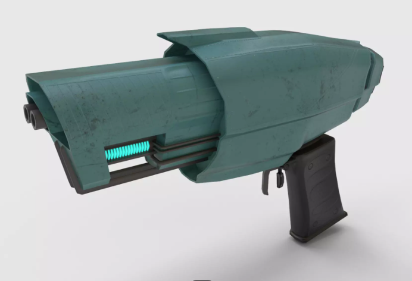
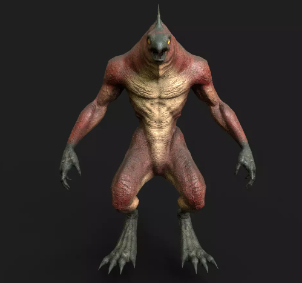
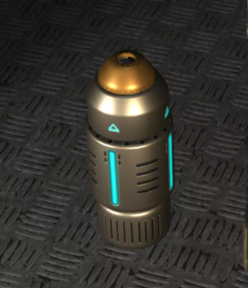
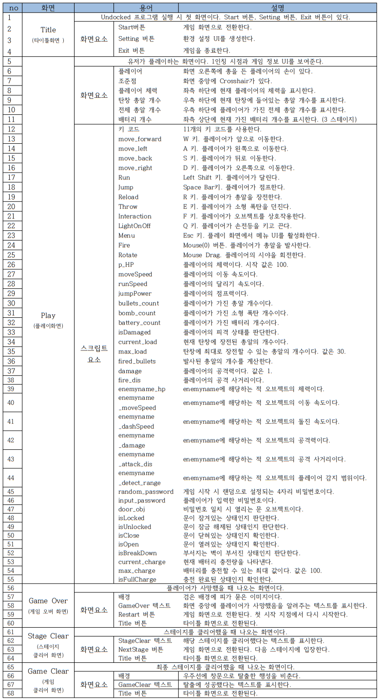

#  프로젝트명 : Undocked(1988037 이휘재) 

# [ 목차 ]
### 1. [컨셉](#1)
### 2. [관련 이미지와 동영상](#2)
### 3. [대표 이미지](#3)
### 4. [컨셉과 대표 이미지 기반 작품 묘사](#4)
### 5. [Undocked 구성 요소](#5)
### 6. [게임 시스템 디자인](#6)
#### &emsp;&emsp; 6-1. [게임 오브젝트 분해](#분해)
#### &emsp;&emsp; 6-2. [오브젝트 속성(파라미터)](#속성)
#### &emsp;&emsp; 6-3. [오브젝트 행동](#행동)
#### &emsp;&emsp; 6-4. [오브젝트 상태](#상태)
#### &emsp;&emsp; 6-5. [게임의 규칙](#규칙)
#### &emsp;&emsp; 6-6. [게임에서 사용될 공식](#공식)
### 7. [개발 요구 사항 흐름도](#7)
#### &emsp;&emsp; 7-1. [요구사항](#요구사항)
#### &emsp;&emsp; 7-2. [6주 요구사항](#6주요구사항)
#### &emsp;&emsp; 7-3. [시간별 흐름도 Flowchart](#시간)
#### &emsp;&emsp; 7-4. [키보드 이벤트에 대한 흐름도](#키보드)
#### &emsp;&emsp; 7-5. [용어정리](#영어)
### 8. [스토리보드](#8)
### 9. [플레이 영상](#9)
[![]URL](https://youtu.be/XDFdNeI1WAM) 

  

# [컨셉]

## 메인컨셉 : 탈출 
- 행성을 탐사하기 위해 만든 기지에서 의문의 사고로부터 탈출하는 컨셉을 통해 SF적인 요소를 더함으로써 유저들에게 흥미를 준다.
- 탈출이라는 목표를 설정함으로써 게임 클리어 후에 해방감을 느낄 수 있도록 한다.

### 서브 컨셉 1 : 전투
- fps 요소를 활용하여 원거리 공격으로 적과 전투를 한다.
- 공격 시 다양한 이펙트를 통해 타격감을 준다.

### 서브 컨셉 2 : 길 찾기
- 플레이어는 맵 어딘가에 있는 목표지점을 찾아 이동해야한다.

### 서브 컨셉 3 : 생존
- 적의 공격으로부터 생존해야 한다.
- 플레이어에게 체력을 부여하고 체력을 관리하도록 해 게임이 지루하지 않게 한다. 

### 서브 컨셉 4 : 적 AI
- 적에게 ai를 부여해 플레이어에게 접근하거나 공격하도록하여 플레이어에게 긴장감을 준다.

### 서브 컨셉 5 : 퍼즐
- 다음 관문으로 넘어가기 위해 숨겨진 아이템이나 단서를 획득하여 사용하는 퍼즐 요소를 통해 플레이어의 이동 및 행동 반경을 넓힌다.

  

# [관련 이미지 & 동영상]

- 이미지  
   
- 동영상
  

  

# [대표 이미지]

 

  

# [컨셉 & 대표이미지 기반 작품묘사]

> ### 대표이미지 기반 :
- 플레이어는 1인칭 시점으로 플레이하고 왼쪽에 총과 손이 보인다.
- 화면 중앙에 조준점으로 사용할 점 모양 CrossHair를 배치한다. 
- 행성 탐사 기지를 배경으로 하는 맵을 사용하고 혼란스러운 상황을 연출한다.
- 빛을 조절하여 어두운 실내를 연출한다. 
- 플레이어가 플레이 화면에 더 몰입할 수 있도록 UI를 간단하게 제작한다.
- 왼쪽 하단에 체력 UI, 오른쪽 하단에 총알 개수 UI를 보여준다.

> ### 컨셉 기반:
- 적 오브젝트는 외계종족 컨셉 오브젝트를 사용하며 기괴한 모션, 사운드를 더하여 플레이어와   적대 
  관계임을 알려준다.
- 적 오브젝트는 랜덤하게 이동하며 주변에 플레이어를 감지해 플레이어를 공격한다.
- 적에게 공격당한 플레이어는 체력이 감소하고 아이템을 통해 체력을 회복할 수 있다.
- 플레이어는 상호작용 기능을 통해 탈출에 필요한 아이템이나 단서를 획득한다.

  

# [<Undocked> 구성 요소]

- 행성 탐사 기지에서 탈출하는 생존 FPS게임

 

## 1. 메커니즘

[도전 과제]

1. 플레이어에게 접근하고 공격하는 적들을 제거하여 생존.
2. 탈출 지점까지 길을 찾아 도착한다.
3. 탈출에 필요한 아이템을 획득하여 탈출에 성공한다.

[재미 요소]

1. 매번 다른 이동 경로를 가지는 적 AI.
2. 실감나는 전투로 느끼는 타격감.
3. 탈출 지점까지 길을 직접 찾아야 한다.
4. 아이템을 사용하여 장애물 파괴
5. 문을 열 수 있는 아이템이나 단서를 모으는 퍼즐 요소

 

## 2. 이야기

[만들게 된 배경]  
- 외계 행성 탐사 기지에서 외계 생명체들로부터 생존하는 sf 요소를 fps 게임에 
적용함으로써 플레이어들에 긴장감을 더할 것이라고 생각했다.
- 먼 우주에서 혼자 남은 막막한 상황에서 끝까지 살아남아 
탈출했을 때(게임을 클리어했을 때) 성취감과 해방감을 느낄 것이라고 생각했다.

[카메라 관점]  
- 1인칭 시점으로 총을 들고 있는 플레이어의 손이 보인다.
- 플레이어가 적으로부터 피격 시 카메라 흔들림 효과가 구현된다.

 

## 3. 미적요소

[디자인]
- 행성 탐사 기지라는 배경 컨셉에 맞는 SF 느낌의 모델로 맵을 제작한다.
- 기괴한 외계 생명체 모델을 적 오브젝트로 사용한다.
- 실감나는 게임 플레이를 위해 하이폴리 모델을 사용한다.

[컬러] 
- 라이트를 조절하여 전체적으로 어두운 분위기를 만들어 게임에 긴장감을 더한다.

[음향]  
- 긴장감을 주기 위해 조용하고 공허한 배경음악으로 플레이어의 발소리를 부각시킨다.
- 총 격발 소리, 재장전 소리 등 타격감 있는 전투 사운드를 사용한다.
- 적대적인 외계 생명체를 표현하기 위해 적에게 기괴한 사운드를 적용한다. 

 

## 4. 기술
- 유니티 3D를 이용하여 구현할 예정이다.

 

# [게임 시스템 디자인] 
## 1. 게임 오브젝트 분해 

|연번|오브젝트 이름|오브젝트 이미지|
|:----:|:----:|:----:|
|1|플레이어||
|2|소총||
|2|에너지 발사기||
|3|집게 외계 종족 일반||
|4|집게 외계 종족 강화||
|5|외계 돌연변이||
|6|감염된 연구원||
|7|리자드||
|8|타이탄알파||
|9|총알||
|10|에너지 총알||
|11|소형 폭탄||
|12|힐팩||
|13|배터리||
|14|모듈식 벽||
|15|모듈식 천장 패널||
|16|모듈식 통로||
|17|선반||
|18|sf 상자||
|19|sf 팔레트||
|20|소화기||
|21|벽 파이프||
|22|sf 문||
|23|우주선||
|24|탄약 상자||
|25|부서지는 벽||
|26|잠겨있는 문||
|27|비밀번호 숫자 패드||
|28|랩탑||
|29|배터리 디스플레이||
|30|플레이어 체력 UI||
|31|전체 총알 개수 UI||
|32|탄창 총알 개수 UI||
|33|배터리 개수 UI||
|34|비밀번호 UI||
|35|우주선 배터리 잔여략 UI||

 

## 2. 플레이어 오브젝트 속성(파라미터) 

|속성|영문명칭|설명|비고|
|:----:|:----:|:----:|:----:|
|체력|p_HP|플레이어의 체력||
|이동속도|moveSpeed|플레이어의 이동 속도||
|달리기 속도|runSpeed|플레이어의 달리기 속도||
|점프력|jumpPower|플레이어의 점프력||
|가진 총알 개수|bullet_count|플레이어가 가진 총알 개수||
|가진 폭탄 개수|bomb_count|플레이어가 가진 소형 폭탄 개수||
|피격 상태|isDamaged|플레이어 피격 상태 판단||

 

## 3. 게임 오브젝트 속성(파라미터)

### 1) 오브젝트 : 소총 

|속성|영문명칭|설명|비고|
|:----:|:----:|:----:|:----:|
|현재 탄창 총알 개수|loaded_bullets_count|현재 탄창에 장전된 총알의 개수||
|탄창 최대 장전 개수|max_load|탄창에 최대로 장전할 수 있는 총알의 개수||
|발사된 총알 개수|fired_bullets|발사된 총알의 개수||
|공격력|damage|플레이어의 공격력||
|공격 사거리|fire_dis|플레이어의 공격 사거리||

### 2) 오브젝트 : 에너지 발사기 

|속성|영문명칭|설명|비고|
|:----:|:----:|:----:|:----:|
|현재 가진 에너지 총알 개수|eBullet_Count|현재 플레이어가 가진 에너지 총알 개수||
|자동 충전 시간|chargeTime|에너지 발사기의 자동 충전 시간||
|공격력|damage|에너지 발사기의 공격력||
|공격 사거리|atk_Dis|에너지 발사기의 공격 사거리||
|공격 범위|atk_Range|에너지 발사기 명중 시 공격 범위||

### 3) 오브젝트 : 집게 외계 종족 일반

|속성|영문명칭|설명|비고|
|:----:|:----:|:----:|:----:|
|체력|ac_HP|집게 외계 종족 일반 오브젝트의 체력||
|이동 속도|ac_moveSpeed|집게 외계 종족 일반 오브젝트의 이동 속도||
|돌진 속도|ac_dashSpeed|집게 외계 종족 일반 오브젝트의 돌진 속도||
|공격력|ac_Damage|집게 외계 종족 일반 오브젝트의 공격력||
|공격 사거리|ac_attck_dis|집게 외계 종족 일반 오브젝트의 공격 사거리||
|감지 범위|ac_detect_Range|플레이어를 감지할 수 있는 범위||

### 4) 오브젝트 : 집게 외계 종족 강화

|속성|영문명칭|설명|비고|
|:----:|:----:|:----:|:----:|
|체력|cm_HP|집게 외계 종족 강화 오브젝트의 체력||
|이동 속도|cm_moveSpeed|집게 외계 종족 강화 오브젝트의 이동 속도||
|돌진 속도|cm_dashSpeed|집게 외계 종족 강화 오브젝트의 돌진 속도||
|공격력|cm_Damage|집게 외계 종족 강화 오브젝트의 공격력||
|공격 사거리|cm_attck_dis|집게 외계 종족 강화 오브젝트의 공격 사거리||
|감지 범위|cm_detect_Range|플레이어를 감지할 수 있는 범위||

### 5) 오브젝트 : 외계 돌연변이

|속성|영문명칭|설명|비고|
|:----:|:----:|:----:|:----:|
|체력|am_HP|외계 돌연변이 오브젝트의 체력||
|이동 속도|am_moveSpeed|외계 돌연변이 오브젝트의 이동 속도||
|돌진 속도|am_dashSpeed|외계 돌연변이 오브젝트의 돌진 속도||
|공격력|am_Damage|외계 돌연변이 오브젝트의 공격력||
|감지 범위|am_detect_Range|플레이어를 감지할 수 있는 범위||

### 6) 오브젝트 : 감염된 연구원

|속성|영문명칭|설명|비고|
|:----:|:----:|:----:|:----:|
|체력|inf_HP|감염된 연구원 오브젝트의 체력||
|이동 속도|inf_moveSpeed|감염된 연구원 오브젝트의 이동 속도||
|돌진 속도|inf_dashSpeed|감염된 연구원 오브젝트의 돌진 속도||
|공격력|inf_Damage|감염된 연구원 오브젝트의 자폭 공격력||
|자폭 범위|inf_detect_Range|감염된 연구원가 자폭하여 피해를 주는 범위||

### 7) 오브젝트 : 리자드

|속성|영문명칭|설명|비고|
|:----:|:----:|:----:|:----:|
|체력|liz_HP|렙틸리언 오브젝트의 체력||
|이동 속도|liz_moveSpeed|리자드 오브젝트의 이동 속도||
|돌진 속도|liz_dashSpeed|리자드 오브젝트의 돌진 속도||
|공격력|liz_Damage|리자드 오브젝트의 공격력||
|공격 사거리|liz_attck_dis|리자드 오브젝트의 공격 사거리||
|감지 범위|liz_detect_Range|플레이어를 감지할 수 있는 범위|| 

### 8) 오브젝트 : 타이탄알파

|속성|영문명칭|설명|비고|
|:----:|:----:|:----:|:----:|
|체력|ta_HP|타이탄알파 오브젝트의 체력||
|이동 속도|ta_moveSpeed|타이탄알파 오브젝트의 이동 속도||
|돌진 속도|ta_dashSpeed|타이탄알파 오브젝트의 돌진 속도||
|공격력|ta_Damage|타이탄알파 오브젝트의 공격력||
|공격 사거리|ta_attck_dis|타이탄알파 오브젝트의 공격 사거리||
|감지 범위|ta_detect_Range|플레이어를 감지할 수 있는 범위||

### 9) 오브젝트 : 비밀번호 숫자 패드

|속성|영문명칭|설명|비고|
|:----:|:----:|:----:|:----:|
|비밀번호|random_password|게임이 시작될 때마다 4자릿수 비밀번호 랜덤 설정||
|입력 비밀번호|input_password|플레이어가 입력한 비밀번호||
|문|door_Obj|비밀번호 일치 시 열리는 문 오브젝트||

### 10) 오브젝트 : 잠겨있는 문

|속성|영문명칭|설명|비고|
|:----:|:----:|:----:|:----:|
|잠긴 상태|isLocked|잠겨있는지 확인한다.||
|잠금 해제 상태|isUnlocked|잠금 해제되었는지 확인한다.||
|닫힌 상태|isClose|닫혀있는 상태인지 확인한다.||
|열린 상태|isOpen|열려있는 상태인지 확인한다.||

### 11) 오브젝트 : 부셔지는 벽

|속성|영문명칭|설명|비고|
|:----:|:----:|:----:|:----:|
|벽 내구도|wallHp|부서지는 벽 오브젝트의 내구도||
|부서짐 상태|isBreakDown|부서지는 벽 오브젝트가 부셔진 상태인지 확인한다.||

### 12) 오브젝트 : 랩탑

|속성|영문명칭|설명|비고|
|:----:|:----:|:----:|:----:|
|전원 켜짐 상태|isLapON|플레이어가 랩탑 오브젝트 사용 중인지 확인한다.||

### 13) 오브젝트: 우주선 배터리 디스플레이

|속성|영문명칭|설명|비고|
|:----:|:----:|:----:|:----:|
|현재 배터리 충전량|current_charge|현재 배터리 충전량을 나타내는 값이다.||
|최대 배터리 충전량|max_charge|배터리를 충전할 수 있는 최대 값이다. 값은 100.||
|충전 완료 상태|isFullCharge|충전 완료된 상태인지 확인한다.||

 

## 4. 플레이어 오브젝트 행동 
 
|행동|영문명칭|설명|
|:----:|:----:|:----:|
|기본|Idle|아무 행동도 하지 않는 모습이다.|
|걷기|Move|W,A,S,D 키 입력 시 전후좌우 방향으로 이동한다.|
|달리기|Run|Left Shift 키 입력 시 달린다.|
|시야 회전|Rotate|마우스 드래그 시 상하좌우 방향으로 회전한다.|ㄷ
|점프|Jump|스페이스 바 입력 시 점프한다.|
|발사|GunFire|마우스 왼쪽 버튼 클릭 시 총알을 발사한다.|
|재장전|Reload|R 키 입력 시 현재 탄창의 총알을 재장전한다.|
|무기 변경|ChangeWeapon|키보드 1, 2키를 입력해 각 무기를 변경한다.|
|던지기|Throw|E 키 입력 시 소형 폭탄 아이템을 던진다.|
|손전등 끄기/켜기|Turn_On_Off|Q 입력 시 손전등을 on/off한다.|
|상호작용|Interaction|F 키 입력 시 게임 오브젝트와 상호작용한다. |

 

## 5. 게임 오브젝트 행동

### 1) 오브젝트 : 집게 외계 종족 일반

|행동|영문명칭|설명|
|:----:|:----:|:----:|
|이동|Move|네비게이션 시스템을 사용해 랜덤 waypoint를 패트롤하며 이동한다.|
|플레이어 감지|Detect|일정 범위 내의 플레이어를 감지한다.|
|돌진|Dash|감지한 플레이어 위치로 돌진한다.|
|근접 공격|Attack|공격 사거리 내의 플레이어를 근접 공격한다.|
|사망|Died|체력이 0 이하일 때 사망한다.|

### 2) 오브젝트 : 집게 외계 종족 강화

|행동|영문명칭|설명|
|:----:|:----:|:----:|
|이동|Move|네비게이션 시스템을 사용해 랜덤 waypoint를 패트롤하며 이동한다.|
|플레이어 감지|Detect|일정 범위 내의 플레이어를 감지한다.|
|돌진|Dash|감지한 플레이어 위치로 돌진한다.|
|근접 공격|Attack|공격 사거리 내의 플레이어를 근접 공격한다.|
|사망|Died|체력이 0 이하일 때 사망한다.|

### 3) 오브젝트 : 외계 돌연변이

|행동|영문명칭|설명|
|:----:|:----:|:----:|
|이동|Move|네비게이션 시스템을 사용해 랜덤 waypoint를 패트롤하며 이동한다.|
|플레이어 감지|Detect|일정 범위 내의 플레이어를 감지한다.|
|돌진|Dash|감지한 플레이어 위치로 돌진한다.|
|사망|Died|체력이 0 이하일 때 사망한다.|

### 4) 오브젝트 : 감염된 연구원

|행동|영문명칭|설명|
|:----:|:----:|:----:|
|이동|Move|네비게이션 시스템을 사용해 랜덤 waypoint를 패트롤하며 이동한다.|
|플레이어 감지|Detect|일정 범위 내의 플레이어를 감지한다.|
|돌진|Dash|감지한 플레이어 위치로 돌진한다.|
|자폭|ExlodeSelf|자폭 범위 내에 플레이어가 들어오면 자폭한다.|
|사망|Died|체력이 0 이하일 때 사망한다.|

### 5) 오브젝트 : 리자드

|행동|영문명칭|설명|
|:----:|:----:|:----:|
|이동|Move|네비게이션 시스템을 사용해 랜덤 waypoint를 패트롤하며 이동한다.|
|플레이어 감지|Detect|일정 범위 내의 플레이어를 감지한다.|
|돌진|Dash|감지한 플레이어 위치로 돌진한다.|
|근접 공격|Attack|공격 사거리 내의 플레이어를 근접 공격한다.|
|사망|Died|체력이 0 이하일 때 사망한다.|

### 6) 오브젝트 : 타이탄 알파

|행동|영문명칭|설명|
|:----:|:----:|:----:|
|이동|Move|네비게이션 시스템을 사용해 랜덤 waypoint를 패트롤하며 이동한다.|
|플레이어 감지|Detect|일정 범위 내의 플레이어를 감지한다.|
|돌진|Dash|감지한 플레이어 위치로 돌진한다.|
|근접 공격|Attack|공격 사거리 내의 플레이어를 근접 공격한다.|
|사망|Died|체력이 0 이하일 때 사망한다.|

### 7) 오브젝트 : 잠겨있는 문

|행동|영문명칭|설명|
|:----:|:----:|:----:|
|열기|Open|비밀번호를 입력해 일치하면 오브젝트를 위로 이동시켜 연다.|

### 8) 오브젝트 : 부셔지는 벽

|행동|영문명칭|설명|
|:----:|:----:|:----:|
|부시기|BreakDown|벽이 뒤로 넘어가 부서지는 애니메이션을 재생한다.|

 

## 6. 플레이어 오브젝트 상태 

|현상태|전이상태|전이조건|
|:----:|:----:|:----:|
|기본||아무 행동 하지 않음|
|모든 상태|이동(걷기)|W,A,S,D 키를 입력한다.|
|모든 상태|달리기|이동 상태이고 Left Shift 키를 입력한다.|
|모든 상태|발사|마우스 왼쪽 버튼을 클릭한다. 총알 개수 > 0|
|모든 상태|재장전|R키를 입력한다. 총알 개수 > 0   현재 탄창 총알 개수 < 탄창 최대 장전 개수|
|모든 상태|1번 무기 사용|1키를 입력한다. 2번 무기 사용 중일 경우.|
|모든 상태|2번 무기 사용|2키를 입력한다. 2번 무기 획득한 경우 && 1번 무기 사용 중일 경우.|
|모든 상태|던지기|E 키를 입력한다. 소형 폭탄 개수 > 0|
|모든 상태|상호작용|F키를 입력한다.|
|모든 상태|피격|적 충돌 및 공격 받을 경우. 플레이어 체력 > 0|
|모든 상태|사망|플레이어 체력 <= 0|

 

## 7. 게임 오브젝트 상태

### 1) 오브젝트 : 집게 외계 종족 일반

|현상태|전이상태|전이조건|
|:----:|:----:|:----:|
|기본|이동|일정 시간마다 랜덤 웨이포인트 지정하여 이동한다.|
|이동|돌진|감지 범위 내의 플레이어를 발견할 경우.|
|돌진|공격|플레이어 오브젝트와의 거리 <= 공격 사거리 |
|생존|피격|플레이어 공격 적중 시. 체력 > 0|
|생존|사망|체력 < = 0|

### 2) 오브젝트 : 집게 외계 종족 강화

|현상태|전이상태|전이조건|
|:----:|:----:|:----:|
|기본|이동|일정 시간마다 랜덤 웨이포인트 지정하여 이동한다.|
|이동|돌진|감지 범위 내의 플레이어를 발견할 경우.|
|돌진|공격|플레이어 오브젝트와의 거리 <= 공격 사거리 |
|생존|피격|플레이어 공격 적중 시. 체력 > 0|
|생존|사망|체력 < = 0|

### 3) 오브젝트 : 외계 돌연변이

|현상태|전이상태|전이조건|
|:----:|:----:|:----:|
|기본|이동|일정 시간마다 랜덤 웨이포인트 지정하여 이동한다.|
|이동|돌진|감지 범위 내의 플레이어를 발견할 경우.|
|생존|피격|플레이어 공격 적중 시. 체력 > 0|
|생존|사망|체력 < = 0|

### 4) 오브젝트 : 감염된 연구원

|현상태|전이상태|전이조건|
|:----:|:----:|:----:|
|기본|이동|일정 시간마다 랜덤 웨이포인트 지정하여 이동한다.|
|이동|돌진|플레이어 체력이 100 미만일 때 플레이어 위치로 돌진 |
|돌진|자폭|레이어 오브젝트와의 거리 <= 자폭 범위|
|생존|피격|플레이어 공격 적중 시. 체력 > 0|
|생존|사망|체력 < = 0|

### 5) 오브젝트 : 리자드

|현상태|전이상태|전이조건|
|:----:|:----:|:----:|
|기본|이동|일정 시간마다 랜덤 웨이포인트 지정하여 이동한다.|
|이동|돌진|감지 범위 내의 플레이어를 발견할 경우.|
|돌진|공격|플레이어 오브젝트와의 거리 <= 공격 사거리 |
|생존|피격|플레이어 공격 적중 시. 체력 > 0|
|생존|사망|체력 < = 0|

### 6) 오브젝트 : 타이탄알파

|현상태|전이상태|전이조건|
|:----:|:----:|:----:|
|기본|이동|일정 시간마다 랜덤 웨이포인트 지정하여 이동한다.|
|이동|돌진|감지 범위 내의 플레이어를 발견할 경우.|
|돌진|공격|플레이어 오브젝트와의 거리 <= 공격 사거리 |
|생존|피격|플레이어 공격 적중 시. 체력 > 0|
|생존|사망|체력 < = 0|

### 7) 오브젝트 : 잠겨있는 문

|현상태|전이상태|전이조건|
|:----:|:----:|:----:|
|잠김|잠금 해제|랜덤 비밀번호 = 입력 비밀번호|
|닫힘|열림|잠금 해제 상태, F 키 입력 시|

### 8) 오브젝트 : 부서지는 벽

|현상태|전이상태|전이조건|
|:----:|:----:|:----:|
|기본|부셔짐|부서지는 벽의 내구도가 0 이하일 때|

 

## 8. 게임의 규칙 
### 1) 핵심 규칙
- 유저는 1인칭 시점으로 플레이어 캐릭터를 컨트롤할 수 있다.
- 플레이어 무기로 총알을 발사해 적을 공격하여 제거할 수 있다.
- 적과 충돌 또는 적에게 공격 받을 경우 플레이어의 체력이 감소한다.
- 플레이어의 체력이 0이 되면 플레이어 사망 판정한다. 게임 오버 씬으로 전환되고 게임을 다시 시작하면   해당 스테이지의 시작 지점에 리스폰한다.
- 2개의 스테이지가 존재하며 플레이어는 각 스테이지 목표 지점까지 길을 찾아가야한다.
- 최종 2스테이지에서 우주선의 배터리를 찾아 충전시켜 탈출하는 것이 목표이다.
### 2) 보조 규칙
- 소형 폭탄 아이템을 획득 후 길이 막힌 곳에 존재하는 부서지는 벽에 사용하여 길을 뚫을 수 있다.
- 힐팩 아이템을 획득하여 감소된 체력을 회복할 수 있다.
- 다음 스테이지로 넘어가기 위한 문을 열기 위해(1,2 스테이지 해당) 랩탑 오브젝트를 상호작용하여   문의 비밀번호를  획득해야 한다.

 

## 9. 게임에서 사용될 공식 
### 1) 총알 발사 공식
플레이어 총알 개수 > 0 && 현재 탄창 개수 > 0일 때 
 마우스 왼쪽 버튼 클릭 시 총알 발사
 현재 탄창 총알 개수 1개 감소
 발사된 총알 개수 1개 증가

### 2) 재장전 공식
현재 탄창 총알 개수 < 탄창 최대 장전 개수일 때 
 R 키(재장전) 입력 시
 현재 탄창 총알 개수 += 발사된 총알 개수
 플레이어 총알 개수 -= 발사된 총알 개수
 발사된 총알 개수 → 0

### 3) 플레이어 오브젝트 피격 및 사망 처리 공식
플레이어 체력 > 0일 때
 적 오브젝트와 충돌하거나 공격 당했을 경우
 체력 감소 → 각 적 오브젝트 공격력에 해당하는 값
 피격 효과 생성 → 화면 붉은 색 
 플레이어 체력 <= 0일 때
 게임 오버 씬 전환 

### 4) 적 오브젝트 돌진 후 공격 공식
일정 범위 내 주변 오브젝트 콜라이더 검출
 콜라이더 태그가 플레이어일 때
 이동 속도 → 돌진 속도
 이동 방향 → 플레이어 오브젝트의 위치
 오브젝트와 플레이어 오브젝트의 거리 <= 공격 사거리일 때
 공격 행동 실행

### 4) 적 오브젝트 피격 및 사망 처리 공식
적 오브젝트 체력 > 0일 때 
 플레이어 총알 적중할 경우
 적 오브젝트 체력 감소 → 플레이어 무기 공격력 값
 피격 이펙트 생성
 적 오브젝트 체력 <= 0일 때
 사망 애니메이션 재생
 약 1초 후 오브젝트 삭제

  

# [개발 요구사항 & 흐름도] 

## 1. 요구사항 
### 1 씬)
1-1. 타이틀 화면, 게임 화면, 게임 오버 화면, 스테이지 클리어 화면, 게임 클리어 화면으로 구성되었다. 
1-2. 타이틀 화면의 배경은 게임 오브젝트를 사용해 혼란스러운 실내 공간을 연출하고 화면 왼쪽에 게임 제목이 적힌 텍스트를 배치한다.    
1-3. 타이틀 화면 제목 텍스트 하단에 게임 시작, 환경 설정, 나가기 버튼을 배치한다. 
1-4. 게임 시작 버튼 클릭 시 게임 화면으로 전환한다. 
1-5. 환경 설정 버튼 클릭 시 환경 설정 UI가 생성된다. 
1-6. 타이틀 화면에서 나가기 버튼을 클릭 시 게임이 종료되도록 한다. 
1-7. 게임 오버 화면에 다시 시작 버튼, 타이틀 버튼을 배치한다. 
1-8. 다시 시작 버튼을 누르면 게임을 처음부터 다시 시작하고 타이틀 버튼을 누르면 타이틀 화면으로 전환한다. 
1-9. 스테이지 클리어 화면은 다음 스테이지 버튼과 타이틀 버튼을 배치한다. 
1-10. 게임 클리어 화면은 타이틀 버튼을 배치한다.  

### 2 플레이)
2-1. 플레이어는 1인칭 시점으로 하고 화면 오른쪽에 플레이어 무기와 손이 보이도록 한다. 
2-2. 플레이어는 W, A, S, D 키를 입력하여 플레이어 오브젝트를 이동한다. 
2-3. 플레이어가 이동 중일 때 Left Shift 키를 입력해 달릴 수 있다. 
2-4. 플레이어는 스페이스 바를 입력해 점프할 수 있다. 
2-5. 플레이어는 마우스 드래그를 하여 시야를 회전한다. 
2-6. 플레이어는 달리지 않는 상태에서 마우스 왼쪽 버튼을 클릭해 총을 발사할 수 있다. 
2-7. R키를 입력해 총알을 재장전할 수 있다. 
2-8. 플레이어가 총알 발사 시 화면 흔들림 효과를 생성한다. 
2-9. 소총 발사 시 총구 위치에서 노란 화염 이펙트를 생성한다. 
2-10. 소총에 적중당한 적의 체력을 1 감소시킨다. 
2-11. 에너지 발사기 발사 시 총구에서 푸른 화염 이펙트를 생성하고 적에 적중시키면 푸른 폭발 이펙트를 생성한다. 
2-12. 에너지 발사기는 범위 데미지를 입히며 적중당한 적의 체력을 2 감소시키고 주변 적들의 체력을 1 감소시키다. 
2-13. 에너지 발사기는 자동 충전 기능을 두어 발사 시 일정 시간 충전하며 충전 시에는 발사할 수 없다. 
2-14. 플레이어는 키보드 1 키를 입력해 소총을 사용할 수 있다. 
2-15. 플레이어는 키보드 2 키를 입력해 에너지 발사기를 사용할 수 있다. 
2-16. 플레이어는 E 키를 입력해 소형 폭탄 아이템을 포물선으로 던질 수 있다. 
2-17. 플레이어는 Q 키를 입력해 손전등의 빛을 끄고 킬 수 있다. 
2-18. 플레이어는 상호작용 가능한 거리에서 오브젝트에 크로스헤어를 조준하여 F 키를 입력하면 각 오브젝트에 맞는 상호작용을 할 수 있다. 
2-19. 1 스테이지 적 오브젝트 3개를 제작한다. (집게 외계 종족 일반, 집게 외계 종족 강화, 외계 돌연변이) 
2-20. 2 스테이지 적 오브젝트 3개를 제작한다. (감염된 연구원, 리자드, 타이탄알파) 
2-21. 외계 돌연변이 오브젝트는 플레이어 감지 시 플레이어 위치로 돌진한다. 
2-22. 집게 외계 종족 일반 오브젝트는 플레이어 감지 시 플레이어 위치로 돌진하고 공격 범위 내에 플레이어가 들어오면 근접 공격한다. 
2-23. 집게 외계 종족 강화 오브젝트는 플레이어 감지 시 플레이어 위치로 돌진하고 공격 범위 내에 플레이어가 들어오면 근접 공격한다. 
2-24. 감염된 연구원 오브젝트는 플레이어 체력 최대 체력이 아닐 때 플레이어 위치로 돌진한다. 
2-25. 감염된 연구원 오브젝트는 자폭하여 플레이어에게 큰 데미지를 입힌다. 
2-26. 감염된 연구원 오브젝트는 자폭 범위 내에 플레이어가 들어오거나 체력이 0일 때 자폭한다. 
2-27. 리자드오브젝트는 플레이어 감지 시 플레이어 위치로 돌진하고 공격 범위 내에 플레이어가 들어오면 근접 공격한다. 
2-28. 타이탄알파 오브젝트는 플레이어 감지 시 플레이어 위치로 돌진하고 공격 범위 내에 플레이어가 들어오면 근접 공격한다. 
2-29. 적 오브젝트들에 웨이포인트를 설정해 랜덤으로 지정하여 패트롤하도록 한다. 
2-30. 적 오브젝트들의 감지 범위 내에 플레이어가 있다면 플레이어를 향해 돌진한다. 
2-31. 적 오브젝트들의 공격 사거리 내에 플레이어가 있다면 공격 모션을 재생한다. 
2-32. 적 오브젝트들은 스테이지가 올라갈수록 높은 체력과 공격력을 가진다. 
2-33. 적 오브젝트의 애니메이션은 기본, 걷기, 돌진, 피격, 공격, 사망 모션을 사용한다. 
2-34. 플레이어가 적 공격에 맞는다면 각 적 오브젝트들의 공격력만큼 체력이 감소한다. 
2-35. 플레이어가 적 공격에 맞으면 약 0.5초 화면이 붉게 변하는 피격효과를 생성하고 카메라 흔들림 효과를 생성한다. 
2-36. 체력이 감소된 상태에서 힐팩 오브젝트를 상호작용하면 체력을 회복한다. 
2-37. 플레이어의 체력이 0이하라면 게임 오버 씬으로 전환된다. 
2-38. 플레이어 총에 명중한 적은 체력이 1감소한다. 
2-39. (1 스테이지)잠겨있는 문 오브젝트를 열기 위해 숫자패드 오브젝트를 배치해 비밀번호를 입력하도록 한다. 
2-40. 비밀번호는 게임이 실행될 때마다 랜덤으로 4자리수를 설정한다. 
2-41. 맵에 존재하는 랩탑 오브젝트를 상호작용하면 랩탑 화면을 비추는 카메라 이동 후 비밀번호 UI를 활성화한다. 
2-42. 비밀번호 단서는 4자리 비밀번호 중 2자리씩 알려준다. ex) "1 _ 3 _", "_ 2 _ 4"
2-43. 잠겨있는 문을 열고 들어가면 스테이지 클리어 화면으로 전환한다. 
2-44. 부서지는 벽을 향해 소형 폭탄을 던져 맞추면 벽이 부서지도록 한다(애니메이션 재생). 
2-45. (2 스테이지) 우주선의 배터리를 모두 찾아 충전을 완료하는 것을 최종 탈출 조건으로 한다. 
2-46. 총알 오브젝트를 상호작용하면 총알 10개를 획득한다. 
2-47. 배터리 오브젝트를 상호작용하여 획득하면 해당 오브젝트를 삭제하고 1개를 획득한다. 
2-48. 배터리 디스플레이 오브젝트를 상호작용하여 현재 배터리 충전량 UI를 생성한다. 
2-49. 우주선 오브젝트를 상호작용하면 배터리 개수가 1개씩 감소하고 배터리 충전량이 20%씩 증가한다. 
2-50. 충전을 완료하면 게임 클리어 화면으로 전환된다. 

### 3 맵)
3-1. 행성 탐사 기지로 배경으로 한다. 
3-2. 사고를 당해 혼란스럽게 어질러진 실내 분위기를 연출한다. 
3-3. 1 스테이지를 제작한다. (Section 1) 
3-4. 2 스테이지를 제작한다. (Section 2) 
3-6. 각 스테이지에 정해진 적 오브젝트들을 생성하도록 한다. 
3-7. 1 스테이지에 부서지는 벽 오브젝트와 잠겨있는 문 오브젝트를 배치한다. 
3-8. 1 스테이지에 넓은 공간을 제작해 플레이어 진입 시 적들이 몰려오는 웨이브 시스템을 제작한다.
3-9. 1 스테이지 웨이브 시작 시 천장에서 붉은색, 흰색 조명을 깜빡이도록한다.

### 4 UI)
4-1. 게임 화면 왼쪽 하단에 플레이어의 체력 UI를 “HP 플레이어 체력” 형태로 배치한다. 
4-2. 게임 화면 오른쪽 하단에 소총 총알 개수 UI를 “현재 탄창 총알 개수 / 전체 탄창 개수” 형태로 배치한다. 
4-3. 게임 화면 오른쪽 하단에 에너지 총알 개수, 자동 충전 바 UI를 배치한다.
4-4. 화면 중앙에 점 모양 크로스헤어를 배치한다. 
4-5. 오브젝트를 상호작용할 때 크로스헤어 위에 텍스트 UI를 생성한다. ex) 획득하기[F], 소형 폭탄 1개 획득 
4-6. 비밀번호 UI는 푸른 배경으로 하고 중앙에 비밀번호 텍스트를 출력한다. ex) “1 _ 2 _” 
4-7. 배터리 충전량 UI는 노란색 배경으로 하고 중앙에 충전량을 텍스트로 출력하고 텍스트 하단에  충전 게이지 바를 배치하여 충전 시 충전량과 게이지가 증가하도록 한다. 
4-8. 배터리 개수 UI는 획득한 배터리 오브젝트의 개수가 1개 이상일 때 화면 왼쪽 상단에 생성하며 배터리 이미지 X 개수 형태로 배치한다. 
4-9. 게임 화면에서 Esc 키를 입력하면 메뉴 UI를 생성한다. 
4-10. 메뉴 UI 왼쪽에 Return, Setting, Exit 버튼을 배치한다. 
4-11. 메뉴 UI 설정 창에서 도움말 버튼을 배치해 클릭 시 조작법 이미지를 활성화한다.  

 

## 2. 6주 요구사항 

~~1. 플레이어는 1인칭 시점으로 하고 화면 오른쪽에 플레이어 무기와 손이 보이도록 한다. (2-1)~~  
~~2. 플레이어는 W, A, S, D 키를 입력하여 플레이어 오브젝트를 이동한다. (2-2)~~  
~~3. 플레이어가 이동 중일 때 Left Shift 키를 입력해 달릴 수 있다. (2-3)~~  
~~4. 플레이어는 스페이스 바를 입력해 점프할 수 있다. (2-4)~~  
~~5. 플레이어는 마우스 드래그를 하여 시야를 회전한다. (2-5)~~  
~~6. 플레이어는 달리지 않는 상태에서 마우스 왼쪽 버튼을 클릭해 총을 발사할 수 있다. (2-6)~~  
~~7. R키를 입력해 총알을 재장전할 수 있다. (2-7)~~  
~~8. 플레이어가 총알 발사 시 화면 흔들림 효과를 생성한다. (2-8)~~  
~~9. 총알 발사 시 총구 위치에서 화염 효과를 생성한다. (2-9)~~  
~~10. 플레이어는 E 키를 입력해 소형 폭탄 아이템을 포물선으로 던질 수 있다. (2-10)  ~~
~~11. 플레이어는 Q 키를 입력해 손전등의 빛을 끄고 킬 수 있다. (2-11)~~  
~~12. 플레이어는 상호작용 가능한 거리에서 오브젝트에 크로스헤어를 조준하여 F 키를 입력하면   각 오브젝트에 맞는 상호작용을 할 수 있다. (2-12)~~  
~~13. 스테이지 적 오브젝트 2개를 제작한다. (렙틸리언, 타이탄 알파)~~ (2-15)  
~~14.적 오브젝트들에 웨이포인트를 설정해 랜덤으로 지정하여 패트롤하도록 한다. (2-16)~~  
~~15. 적 오브젝트들의 감지 범위 내에 플레이어가 있다면 플레이어를 향해 돌진한다. (2-17)~~  
~~16. 적 오브젝트들의 공격 사거리 내에 플레이어가 있다면 공격 모션을 재생한다. (2-18)~~  
~~17. 적 오브젝트들은 스테이지가 올라갈수록 높은 체력과 공격력을 가진다. (2-19)~~  
~~18.적 오브젝트의 애니메이션은 기본, 걷기, 돌진, 피격, 공격, 사망 모션을 사용한다. (2-20)~~  
~~19. 플레이어가 적 공격에 맞는다면 각 적 오브젝트들의 공격력만큼 체력이 감소한다. (2-21)~~  
~~20. 플레이어가 적 공격에 맞으면 약 0.5초 화면이 붉게 변하는 피격효과를 생성하고 카메라 흔들림 효과를 생성한다. (2-22)~~  
~~21. 체력이 감소된 상태에서 힐팩 오브젝트를 상호작용하면 체력을 회복한다. (2-23)~~  
22. 플레이어의 체력이 0이하라면 게임 오버 씬으로 전환된다. (2-24)  
~~23. 플레이어 총에 명중한 적은 체력이 1감소한다. (2-25)~~  
~~24. (3스테이지) 우주선의 배터리를 모두 찾아 충전을 완료하는 것을 최종 탈출 조건으로 한다. (2-31)~~  
~~25. 총알 오브젝트를 상호작용하면 총알 10개를 획득한다. (2-32)~~  
~~26. 배터리 오브젝트를 상호작용하여 획득하면 해당 오브젝트를 삭제하고 1개를 획득한다. (2-33)~~  
~~27. 배터리 디스플레이 오브젝트를 상호작용하여 현재 배터리 충전량 UI를 생성한다. (2-34)~~  
~~28. 우주선 오브젝트를 상호작용하면 배터리 개수가 1개씩 감소하고 배터리 충전량이 20%씩 증가한다.~~ (2-35)  
29. 충전을 완료하면 게임 클리어 화면으로 전환된다. (2-36)  
~~30. 행성 탐사 기지로 배경으로 한다. (3-1)~~  
~~31. 사고를 당해 혼란스럽게 어질러진 실내 분위기를 연출한다. (3-2)~~  
~~32. 1 스테이지를 제작한다. (Section 1) (3-3)~~  
~~33. 게임 화면 왼쪽 하단에 플레이어의 체력 UI를 “HP 플레이어 체력” 형태로 배치한다. (4-1)~~  
~~34. 게임 화면 오른쪽 하단에 총알 개수 UI를 “현재 탄창 총알 개수 / 전체 탄창 개수” 형태로 배치한다. (4-2)~~  
~~35. 화면 중앙에 점 모양 크로스헤어를 배치한다. (4-3)~~  
~~36. 오브젝트를 상호작용할 때 크로스헤어 위에 텍스트 UI를 생성한다. ex) 획득하기[F], 소형 폭탄 1개 획득, (4-4)~~  
~~37. 배터리 충전량 UI는 노란색 배경으로 하고 중앙에 충전량을 텍스트로 출력하고 텍스트 하단에 충전 게이지 바를 배치하여 충전 시 충전량과 게이지가 증가하도록 한다. (4-6)~~  
~~38. 배터리 개수 UI는 획득한 배터리 오브젝트의 개수가 1개 이상일 때 화면 왼쪽 상단에 생성하며 배터리 이미지 X 개수 형태로 배치한다. (4-7)~~  

 

## 3. 시간별 흐름도 Flowchart 

 

## 4. 키보드 이벤트에 대한 흐름도 

 

## 5. 용어 정리 

  

# [스토리 보드] 

  

